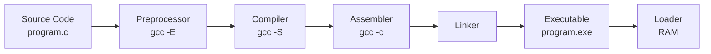

# x86 Assembly Reversing Guide

> A comprehensive guide to x86/x64 assembly language and reverse engineering fundamentals

[](https://opensource.org/licenses/MIT)

---

## Table of Contents

- [Introduction](#introduction)
- [Part 1: Fundamentals](#part-1---fundamentals)
  - [The Language Processing System](#the-language-processing-system)
  - [Memory Layout](#memory-layout)
  - [x86 CPU Architecture](#x86-cpu-architecture)
  - [Common x86 Registers](#common-x86-registers)
  - [Common x86 Instructions](#common-x86-instructions)
  - [Stack Operations](#stack-operations)
  - [Calling Conventions](#calling-conventions)
- [Part 2: Practical Reversing with Ghidra](#part-2---practical-reversing-with-ghidra)
  - [Ghidra Setup and Orientation](#ghidra-setup-and-orientation)
  - [Reversing Practice Examples](#reversing-practice-examples)
- [Part 3: Advanced Topics](#part-3---advanced-topics)
  - [x64 Architecture Differences](#x64-architecture-differences)
  - [Anti-Reversing Techniques](#anti-reversing-techniques)
- [Practice Challenges](#practice-challenges)
- [Summary and Next Steps](#summary-and-next-steps)
- [Tools and Resources](#tools-and-resources)

---

## Introduction

Reverse engineering x86 assembly is a critical skill for understanding how programs work at the lowest level. This guide covers everything from basic architecture to practical reversing with Ghidra.

**What You'll Learn:**
- x86/x64 architecture fundamentals
- Reading and understanding assembly code
- Using Ghidra for reverse engineering
- Identifying common code patterns
- Reconstructing high-level logic from assembly

**Prerequisites:**
- Basic understanding of C/C++
- Familiarity with hexadecimal notation
- Understanding of basic programming concepts

---

## Part 1 - Fundamentals

### The Language Processing System

The journey from source code to executable involves several stages:



#### Compilation Stages

**1. Preprocessor** (`gcc -E program.c`)
```c
// Before preprocessing
#define MAX 100
int arr[MAX];

// After preprocessing
int arr[100];
```
- Processes `#include`, `#define`, `#ifdef`
- Expands macros
- Removes comments

**2. Compiler** (`gcc -S program.c`)
```bash
# Generates program.s (assembly code)
gcc -S -masm=intel program.c  # Intel syntax
gcc -S program.c              # AT&T syntax (default)
```
- Translates C to assembly
- Performs optimizations
- Generates `.s` file

**3. Assembler** (`gcc -c program.c`)
```bash
# Generates program.o (object file)
gcc -c program.c
objdump -d program.o  # View machine code
```
- Converts assembly to machine code
- Creates relocatable object file
- Symbol table created

**4. Linker**
```bash
# Links object files and libraries
gcc program.o utils.o -o program
```
- Merges multiple object files
- Resolves external references
- Creates final executable

**5. Loader**
- Loads executable into RAM
- Sets up process memory
- Transfers control to entry point

---

### Memory Layout

Understanding how programs are laid out in memory is fundamental to reverse engineering:

```
High Address (0x7FFFFFFF or 0x7FFFFFFFFFFF in x64)
+----------------------------------+
|         Kernel Space             |
+----------------------------------+
|     Environment Variables        |
+----------------------------------+
|      Command Line Args           |
+----------------------------------+
|                                  |
|          Stack                   |
|           |                      |  Grows downward
|           v                      |
|                                  |
|     (Unmapped Memory)            |
|                                  |
|           ^                      |
|           |                      |  Grows upward
|          Heap                    |
|                                  |
+----------------------------------+
|     .bss (Uninitialized)         |
+----------------------------------+
|     .data (Initialized)          |
+----------------------------------+
|     .rodata (Read-Only)          |
+----------------------------------+
|       .text (Code)               |
+----------------------------------+
Low Address (0x00400000 typical start)
```

#### Memory Sections Explained

| Section | Purpose | Permissions | Example Content |
|---------|---------|-------------|-----------------|
| `.text` | Program instructions | R-X | Compiled code |
| `.rodata` | Read-only data | R-- | String literals, const data |
| `.data` | Initialized static/global | RW- | `int x = 5;` |
| `.bss` | Uninitialized static/global | RW- | `int arr[100];` |
| `Heap` | Dynamic allocations | RW- | `malloc()`, `new` |
| `Stack` | Local vars, function calls | RW- | Local variables |

**Example:**
```c
// Code section (.text)
int add(int a, int b) {
    return a + b;
}

// Read-only data (.rodata)
const char* msg = "Hello";

// Initialized data (.data)
int global_var = 42;

// Uninitialized data (.bss)
int buffer[1024];

int main() {
    // Stack
    int local = 10;
    
    // Heap
    int* ptr = malloc(sizeof(int));
    
    return 0;
}
```

---

### x86 CPU Architecture

The CPU consists of several key components:

```
+-----------------------------------------------+
|      Central Processing Unit (CPU)           |
+---------------------+-------------------------+
|   Control Unit      |  Arithmetic Logic Unit  |
| (Fetch & Decode)    |   (Execute & Store)     |
|                     |                         |
| - Fetches from RAM  | - Performs operations   |
| - Decodes instrs    | - Sets flags            |
| - Controls flow     | - Updates registers     |
+---------------------+-------------------------+
            |                      |
            v                      v
+-----------------------------------------------+
|          Registers (Fast Storage)             |
| RAX RBX RCX RDX RSI RDI RBP RSP RIP RFLAGS   |
+-----------------------------------------------+
            |
            v
+-----------------------------------------------+
|       Main Memory (RAM - Slower)              |
|   .text  .data  .bss  Heap  Stack            |
+-----------------------------------------------+
```

**Execution Cycle:**
1. **Fetch:** Control Unit fetches instruction from memory at RIP
2. **Decode:** Instruction is decoded into micro-operations
3. **Execute:** ALU performs the operation
4. **Store:** Results written back to registers/memory
5. **Update RIP:** Move to next instruction

---

### Common x86 Registers

Registers are fast storage locations within the CPU. Understanding register naming is crucial:

#### Register Size Hierarchy

```
+-------------------------------------------------------+
|                    64-bit (RAX)                       |
|  +-----------------------------------------------+    |
|  |             32-bit (EAX)                      |    |
|  |  +---------------------------------------+    |    |
|  |  |        16-bit (AX)                    |    |    |
|  |  |  +--------------+--------------+      |    |    |
|  |  |  |  AH (8-bit)  |  AL (8-bit)  |      |    |    |
+--+--+--+--------------+--------------+------+----+----+
63                                                      0
```

#### General Purpose Registers

| Register | Full Name | Primary Use | Special Notes |
|----------|-----------|-------------|---------------|
| **RAX/EAX/AX/AH/AL** | Accumulator | Return values, I/O | Function returns in EAX/RAX |
| **RBX/EBX/BX/BH/BL** | Base | Base pointer for memory | Callee-saved |
| **RCX/ECX/CX/CH/CL** | Counter | Loop counters | First arg in fastcall |
| **RDX/EDX/DX/DH/DL** | Data | I/O, extends RAX | Second arg in fastcall |
| **RSI/ESI/SI/SIL** | Source Index | String source | Second arg in x64 (Linux) |
| **RDI/EDI/DI/DIL** | Destination Index | String destination | First arg in x64 (Linux) |
| **RBP/EBP/BP/BPL** | Base Pointer | Stack frame base | Points to current frame |
| **RSP/ESP/SP/SPL** | Stack Pointer | Stack top | Always points to stack top |

#### Special Registers

| Register | Purpose | Notes |
|----------|---------|-------|
| **RIP/EIP/IP** | Instruction Pointer | Next instruction address |
| **RFLAGS/EFLAGS** | Status Flags | ZF, CF, SF, OF, etc. |
| **R8-R15** | Extra GPRs (x64 only) | Additional registers in 64-bit |
| **CS/DS/SS/ES/FS/GS** | Segment Registers | Memory segmentation (rarely used in modern OS) |

#### Important RFLAGS Flags

| Flag | Bit | Name | Set When | Common Use |
|------|-----|------|----------|------------|
| **CF** | 0 | Carry Flag | Unsigned overflow | Unsigned arithmetic |
| **PF** | 2 | Parity Flag | Even # of 1 bits | Error checking |
| **ZF** | 6 | Zero Flag | Result is zero | Equality checks |
| **SF** | 7 | Sign Flag | Result is negative | Signed comparisons |
| **OF** | 11 | Overflow Flag | Signed overflow | Signed arithmetic |
| **DF** | 10 | Direction Flag | String direction | String operations |

**Example Flag Usage:**
```nasm
mov eax, 5
cmp eax, 5      ; EAX - 5, sets ZF=1 (equal)
je  equal       ; Jump if ZF=1

mov eax, 10
sub eax, 20     ; Result: -10, sets SF=1 (negative)
js  negative    ; Jump if SF=1
```

---

### Common x86 Instructions

#### Data Movement Instructions

```nasm
; MOV - Copy data
mov eax, ebx           ; EAX = EBX (register to register)
mov eax, 0x1337        ; EAX = 0x1337 (immediate to register)
mov eax, [0x401000]    ; EAX = value at address 0x401000
mov [ebx], eax         ; Store EAX at address in EBX
mov DWORD PTR [ebx], 5 ; Store 5 (4 bytes) at [EBX]

; MOVSX/MOVZX - Move with sign/zero extension
movsx eax, bl          ; Sign-extend BL (8-bit) to EAX (32-bit)
movzx eax, bl          ; Zero-extend BL to EAX

; LEA - Load Effective Address (calculate address)
lea eax, [ebx+ecx*4]   ; EAX = EBX + ECX*4 (the address itself)
lea eax, [ebx+8]       ; EAX = EBX + 8 (useful for pointer arithmetic)

; XCHG - Exchange values
xchg eax, ebx          ; Swap EAX and EBX
```

**MOV vs LEA Example:**
```nasm
mov ebx, 0x1000
mov ecx, 2

; Using MOV - loads the VALUE at the address
mov eax, [ebx+ecx*4]   ; EAX = value at address (0x1000 + 2*4 = 0x1008)

; Using LEA - calculates the ADDRESS
lea eax, [ebx+ecx*4]   ; EAX = 0x1008 (the address itself)
```

#### Arithmetic Instructions

```nasm
; Basic arithmetic
add eax, 5             ; EAX = EAX + 5
sub eax, 3             ; EAX = EAX - 3
inc eax                ; EAX++ (faster than add eax, 1)
dec eax                ; EAX--
neg eax                ; EAX = -EAX (two's complement)

; Multiplication (unsigned)
mov eax, 5
mov ebx, 3
mul ebx                ; EDX:EAX = EAX * EBX (64-bit result)

; Multiplication (signed)
imul eax, ebx          ; EAX = EAX * EBX
imul eax, ebx, 10      ; EAX = EBX * 10
imul eax, 5            ; EAX = EAX * 5

; Division (unsigned)
mov eax, 100
mov edx, 0             ; Clear upper bits
mov ebx, 3
div ebx                ; EAX = quotient (33), EDX = remainder (1)

; Division (signed)
mov eax, -100
cdq                    ; Sign-extend EAX into EDX:EAX
mov ebx, 3
idiv ebx               ; EAX = -33, EDX = -1
```

#### Bitwise Operations

```nasm
; Logical operations
xor eax, eax           ; Clear EAX (common idiom, faster than mov eax, 0)
or  eax, 0x00FF        ; Set lower byte
and eax, 0xFF00        ; Mask to keep only bits 8-15
not eax                ; Bitwise NOT (flip all bits)

; Bit shifts (logical)
shl eax, 3             ; Shift left by 3 (multiply by 8)
shr eax, 2             ; Shift right by 2 (divide by 4, unsigned)

; Bit shifts (arithmetic)
sal eax, 1             ; Shift arithmetic left (same as SHL)
sar eax, 1             ; Shift arithmetic right (preserves sign bit)

; Rotates
rol eax, 4             ; Rotate left by 4 bits
ror eax, 4             ; Rotate right by 4 bits

; Bit test operations
bt  eax, 5             ; Test bit 5, set CF to bit value
bts eax, 5             ; Test and set bit 5
btr eax, 5             ; Test and reset bit 5
btc eax, 5             ; Test and complement bit 5
```

**Shift vs Rotate:**
```nasm
; Shift: bits "fall off"
mov al, 0b10110101
shl al, 2              ; AL = 0b11010100 (top bits lost)

; Rotate: bits wrap around
mov al, 0b10110101
rol al, 2              ; AL = 0b11010110 (top bits wrap to bottom)
```

#### Comparison and Control Flow

```nasm
; Comparison (subtracts but doesn't store result)
cmp eax, 5             ; Compare EAX with 5 (sets flags)
cmp [ebx], 0           ; Compare value at [EBX] with 0

; Test (bitwise AND but doesn't store result)
test eax, eax          ; Check if EAX is 0 (sets ZF if zero)
test al, 1             ; Check if bit 0 is set (odd/even check)

; Unconditional jumps
jmp 0x401000           ; Jump to address
jmp eax                ; Jump to address in EAX (indirect)

; Conditional jumps (signed)
je  label              ; Jump if Equal (ZF=1)
jne label              ; Jump if Not Equal (ZF=0)
jg  label              ; Jump if Greater (signed)
jge label              ; Jump if Greater or Equal (signed)
jl  label              ; Jump if Less (signed)
jle label              ; Jump if Less or Equal (signed)

; Conditional jumps (unsigned)
ja  label              ; Jump if Above (unsigned >)
jae label              ; Jump if Above or Equal (unsigned >=)
jb  label              ; Jump if Below (unsigned <)
jbe label              ; Jump if Below or Equal (unsigned <=)

; Flag-based jumps
jz  label              ; Jump if Zero (ZF=1)
jnz label              ; Jump if Not Zero (ZF=0)
js  label              ; Jump if Sign (SF=1, negative)
jns label              ; Jump if Not Sign (SF=0, positive)
jo  label              ; Jump if Overflow (OF=1)
jno label              ; Jump if Not Overflow (OF=0)
jc  label              ; Jump if Carry (CF=1)
jnc label              ; Jump if Not Carry (CF=0)
```

**Conditional Jump Cheat Sheet:**
```nasm
cmp eax, ebx

; For signed integers:
jg  greater_signed     ; EAX > EBX (signed)
jl  less_signed        ; EAX < EBX (signed)

; For unsigned integers:
ja  greater_unsigned   ; EAX > EBX (unsigned)
jb  less_unsigned      ; EAX < EBX (unsigned)
```

#### String Operations

```nasm
; String comparison
mov esi, string1       ; Source
mov edi, string2       ; Destination
mov ecx, 10            ; Length
repe cmpsb             ; Compare until mismatch or ECX=0
; ZF=1 if equal, ZF=0 if different

; Initialize buffer
mov edi, buffer        ; Destination
mov al, 0              ; Value to store
mov ecx, 100           ; Count
rep stosb              ; Fill 100 bytes with 0

; Copy memory
mov esi, source        ; Source
mov edi, destination   ; Destination
mov ecx, 50            ; Byte count
rep movsb              ; Copy 50 bytes
; Use rep movsd for 4-byte copies

; Search for byte
mov edi, buffer        ; Buffer to search
mov al, 'A'            ; Byte to find
mov ecx, 100           ; Max search length
repne scasb            ; Search until found or ECX=0
; If found: ECX != 0, EDI points past match

; Load from string
mov esi, source
lodsb                  ; AL = [ESI], ESI++
lodsd                  ; EAX = [ESI], ESI += 4
```

**Direction Flag (DF):**
```nasm
cld                    ; Clear DF: process strings forward (ESI++, EDI++)
std                    ; Set DF: process strings backward (ESI--, EDI--)
```

#### Stack Operations

```nasm
; Basic stack operations
push eax               ; [ESP] = EAX, ESP -= 4
pop  ebx               ; EBX = [ESP], ESP += 4

push 0x1234            ; Push immediate value
push DWORD PTR [eax]   ; Push value from memory

; Multiple register push/pop
pusha                  ; Push all 16-bit GPRs (AX, CX, DX, BX, SP, BP, SI, DI)
pushad                 ; Push all 32-bit GPRs (EAX, ECX, EDX, EBX, ESP, EBP, ESI, EDI)
popa                   ; Pop to 16-bit GPRs
popad                  ; Pop to 32-bit GPRs

; Function calls
call function_addr     ; Push return address, jump to function
call eax               ; Call function at address in EAX (indirect)
ret                    ; Pop return address and jump there
ret 0x10               ; Return and clean 16 bytes from stack (stdcall)

; Stack frame management
enter 16, 0            ; Create stack frame (allocate 16 bytes)
leave                  ; Restore stack frame (mov esp, ebp; pop ebp)
```

#### Miscellaneous Instructions

```nasm
; No operation
nop                    ; Do nothing (1 byte, used for padding/alignment)

; CPU halt
hlt                    ; Halt CPU until interrupt

; Breakpoint
int 3                  ; Software breakpoint (0xCC byte)

; Clear/Set flags
clc                    ; Clear Carry Flag
stc                    ; Set Carry Flag
cld                    ; Clear Direction Flag
std                    ; Set Direction Flag
cli                    ; Clear Interrupt Flag (disable interrupts)
sti                    ; Set Interrupt Flag (enable interrupts)
```

---

### Stack Operations

The stack is a LIFO (Last In, First Out) data structure that grows **downward** toward lower memory addresses.

#### Stack Visualization

**Before any operations:**
```
High Address
+-------------+
|   0x500     |
+-------------+
|   0x400     |
+-------------+
|   0x300     |
+-------------+  <-- ESP
|             |
+-------------+
Low Address
```

**After PUSH 10:**
```
High Address
+-------------+
|   0x500     |
+-------------+
|   0x400     |
+-------------+
|    10       |
+-------------+  <-- ESP
|   0x300     |
+-------------+
Low Address
```

**After PUSH 20:**
```
High Address
+-------------+
|   0x500     |
+-------------+
|   0x400     |
+-------------+
|    20       |  <-- ESP
+-------------+
|    10       |
+-------------+
|   0x300     |
+-------------+
Low Address
```

#### Stack Frame Anatomy

A typical function call creates a stack frame:

**Function Prologue:**
```nasm
push ebp
mov ebp, esp
sub esp, 0x10
```

**Function Epilogue:**
```nasm
mov esp, ebp
pop ebp
ret
```

**Stack Frame Layout:**
```
High Address
+-------------------+
|   Param 2         |  <-- [EBP+12]
+-------------------+
|   Param 1         |  <-- [EBP+8]
+-------------------+
| Return Address    |  <-- [EBP+4]
+-------------------+
|  Saved EBP        |  <-- [EBP] (EBP points here)
+-------------------+
|   Local 1         |  <-- [EBP-4]
+-------------------+
|   Local 2         |  <-- [EBP-8]
+-------------------+
|   Local 3         |  <-- [EBP-12]
+-------------------+
|   Local 4         |  <-- [EBP-16] (ESP points here)
+-------------------+
Low Address
```

#### Stack Example: Function Call

```c
// C code
int add(int a, int b) {
    int result = a + b;
    return result;
}

int main() {
    int x = add(5, 3);
    return 0;
}
```

```nasm
; Caller (main)
push 3              ; Push second argument
push 5              ; Push first argument
call add            ; Push return address, jump to add
add esp, 8          ; Clean up stack (caller cleanup - cdecl)

; Callee (add)
add:
    push ebp            ; Save old base pointer
    mov ebp, esp        ; Set new base pointer
    sub esp, 4          ; Allocate space for 'result'
    
    mov eax, [ebp+8]    ; EAX = a (first parameter)
    add eax, [ebp+12]   ; EAX = a + b
    mov [ebp-4], eax    ; result = EAX
    
    mov eax, [ebp-4]    ; Return value in EAX
    
    mov esp, ebp        ; Restore stack pointer
    pop ebp             ; Restore base pointer
    ret                 ; Return to caller
```

**Stack State Transitions:**

**1. Before call:**
```
+-----------+
|     3     |
+-----------+
|     5     |
+-----------+
|    ...    |  <-- ESP
+-----------+
```

**2. After call:**
```
+-----------+
|     3     |
+-----------+
|     5     |
+-----------+
| Ret Addr  |  <-- ESP
+-----------+
|    ...    |
+-----------+
```

**3. After push ebp:**
```
+-----------+
|     3     |
+-----------+
|     5     |
+-----------+
| Ret Addr  |
+-----------+
| Old EBP   |  <-- ESP
+-----------+
```

**4. After mov ebp,esp:**
```
+-----------+
|     3     |  [EBP+12]
+-----------+
|     5     |  [EBP+8]
+-----------+
| Ret Addr  |  [EBP+4]
+-----------+
| Old EBP   |  [EBP] <-- EBP, ESP
+-----------+
```

**5. After sub esp,4:**
```
+-----------+
|     3     |  [EBP+12]
+-----------+
|     5     |  [EBP+8]
+-----------+
| Ret Addr  |  [EBP+4]
+-----------+
| Old EBP   |  [EBP] <-- EBP
+-----------+
|  result   |  [EBP-4] <-- ESP
+-----------+
```

**6. During execution:**
```
+-----------+
|     3     |  [EBP+12]
+-----------+
|     5     |  [EBP+8]
+-----------+
| Ret Addr  |  [EBP+4]
+-----------+
| Old EBP   |  [EBP] <-- EBP
+-----------+
|     8     |  [EBP-4] <-- ESP
+-----------+
```

---

### Calling Conventions

Calling conventions define how functions receive parameters, return values, and clean up the stack.

#### cdecl (C Declaration) - Default for C

**Characteristics:**
- Parameters pushed **right-to-left**
- **Caller** cleans up stack
- Return value in **EAX** (integers), **ST(0)** (floats)
- EBX, ESI, EDI, EBP are **callee-saved**

```c
int add(int x, int y, int z);
result = add(1, 2, 3);
```

```nasm
; Caller
push 3          ; z (rightmost parameter first)
push 2          ; y
push 1          ; x
call add        ; Call function
add esp, 12     ; Caller cleanup (3 params * 4 bytes)
; EAX contains return value

; Callee
add:
    push ebp
    mov ebp, esp
    
    mov eax, [ebp+8]    ; x
    add eax, [ebp+12]   ; + y
    add eax, [ebp+16]   ; + z
    
    pop ebp
    ret                 ; Callee does NOT clean stack
```

**Pros:** Variable arguments possible (`printf`, `scanf`)  
**Cons:** Caller must clean up (larger code size)

---

#### stdcall (Standard Call) - Windows API

**Characteristics:**
- Parameters pushed **right-to-left**
- **Callee** cleans up stack
- Return value in **EAX**
- EBX, ESI, EDI, EBP are **callee-saved**

```nasm
; Caller
push 3
push 2
push 1
call add        ; Callee will clean up
; No stack cleanup needed

; Callee
add:
    push ebp
    mov ebp, esp
    
    mov eax, [ebp+8]
    add eax, [ebp+12]
    add eax, [ebp+16]
    
    pop ebp
    ret 12          ; Clean 12 bytes (3 params * 4)
```

**Pros:** Smaller caller code (no cleanup)  
**Cons:** No variable arguments, callee must know param count

**Example:** Windows API functions
```nasm
push 0                  ; hWnd
push offset szText      ; lpText
push offset szTitle     ; lpCaption
push 0                  ; uType
call MessageBoxA        ; Callee cleans stack
```

---

#### fastcall - Optimized Calling

**x86 (32-bit) fastcall:**
- First **2 parameters** in **ECX, EDX**
- Remaining parameters on stack (right-to-left)
- **Callee** cleans stack
- Return in **EAX**

```nasm
; add(1, 2, 3, 4)
mov ecx, 1      ; First parameter
mov edx, 2      ; Second parameter
push 4          ; Fourth parameter (right-to-left)
push 3          ; Third parameter
call add
; Callee cleans stack

add:
    ; ECX = first param
    ; EDX = second param
    ; [ESP+4] = third param
    ; [ESP+8] = fourth param
    ; ... function body ...
    ret 8       ; Clean 2 stack parameters
```

---

#### x64 Calling Conventions

**Microsoft x64 (Windows):**
- First **4 parameters:** RCX, RDX, R8, R9
- **Floating-point:** XMM0, XMM1, XMM2, XMM3
- Additional parameters on stack
- **Caller** allocates 32 bytes "shadow space"
- **Caller** cleans stack
- Return: RAX (integer), XMM0 (float)

```nasm
; Windows x64: add(1, 2, 3, 4, 5)
sub rsp, 40         ; Shadow space (32) + stack params (8) + alignment
mov rcx, 1          ; First parameter
mov rdx, 2          ; Second parameter
mov r8, 3           ; Third parameter
mov r9, 4           ; Fourth parameter
mov qword ptr [rsp+32], 5   ; Fifth parameter on stack
call add
add rsp, 40         ; Caller cleanup

add:
    ; RCX, RDX, R8, R9 contain first 4 params
    ; [RSP+40] = fifth param (after return address + shadow space)
    ; ... function body ...
    ret
```

**System V x64 (Linux/Unix):**
- First **6 parameters:** RDI, RSI, RDX, RCX, R8, R9
- **Floating-point:** XMM0-XMM7
- Additional parameters on stack
- Return: RAX (integer), XMM0 (float)
- **No shadow space**

```nasm
; Linux x64: add(1, 2, 3, 4, 5, 6, 7)
push 7              ; Seventh parameter (stack)
mov rdi, 1          ; First parameter
mov rsi, 2          ; Second parameter
mov rdx, 3          ; Third parameter
mov rcx, 4          ; Fourth parameter
mov r8, 5           ; Fifth parameter
mov r9, 6           ; Sixth parameter
call add
add rsp, 8          ; Clean stack parameter

add:
    ; RDI, RSI, RDX, RCX, R8, R9 contain first 6 params
    ; [RSP+8] = seventh param
    ; ... function body ...
    ret
```

#### Comparison Table

| Convention | Param Order | Params Location | Stack Cleanup | Return | Platform |
|------------|-------------|-----------------|---------------|--------|----------|
| **cdecl** | Right-to-left | Stack | Caller | EAX | Linux 32-bit |
| **stdcall** | Right-to-left | Stack | Callee | EAX | Windows API |
| **fastcall (x86)** | Right-to-left | ECX, EDX, Stack | Callee | EAX | Optimized 32-bit |
| **MS x64** | Left-to-right | RCX, RDX, R8, R9, Stack | Caller | RAX | Windows 64-bit |
| **System V x64** | Left-to-right | RDI, RSI, RDX, RCX, R8, R9, Stack | Caller | RAX | Linux 64-bit |

---

## Part 2 - Practical Reversing with Ghidra

### Ghidra Setup and Orientation

Ghidra is a free, open-source reverse engineering tool developed by the NSA.

#### Installation

1. **Download Ghidra:** [GitHub Releases](https://github.com/NationalSecurityAgency/ghidra/releases)
2. **Install Java JDK 17+:** Required for Ghidra
3. **Extract and run:** `ghidraRun.bat` (Windows) or `ghidraRun` (Linux)

#### Initial Setup

**Creating a Project:**
```
1. File → New Project → Non-Shared Project
2. Choose project directory
3. Name your project (e.g., "x86_reversing_practice")
```

**Importing a Binary:**
```
1. File → Import File
2. Select your executable
3. Ghidra auto-detects format (PE, ELF, etc.)
4. Click OK
```

**Analyzing the Binary:**
```
1. Double-click the imported file
2. Analyze dialog appears
3. Keep default analyzers checked:
   ✓ ASCII Strings
   ✓ Function Start Search
   ✓ Stack
   ✓ Decompiler Parameter ID
4. Click "Analyze"
```

#### Essential Ghidra Shortcuts

| Shortcut | Action |
|----------|--------|
| `G` | Go to address |
| `L` | Rename symbol/variable |
| `T` | Edit data type |
| `Ctrl+L` | Retype variable |
| `;` | Add comment |
| `Ctrl+Shift+G` | Find references to |
| `Ctrl+Shift+E` | Find references from |
| `Spacebar` | Switch Listing ↔ Decompiler |
| `F` | Create function |
| `D` | Disassemble |
| `C` | Clear code bytes |

---

### Reversing Practice Examples

Let's reverse engineer common function patterns you'll encounter.

#### Example 1: Reversing main()

**Ghidra Decompiler Output:**
```c
undefined4 FUN_00401000(void)
{
  FUN_00401050();
  FUN_00401100(1,2,3);
  FUN_00401200();
  return 0;
}
```

**Analysis Steps:**

1. **Identify entry point:** Look for `main` or `entry`
2. **Check function calls:** What other functions are called?
3. **Look for string references:** Right-click → "Show References to"
4. **Rename functions:** Press `L` to rename meaningfully

**After renaming:**
```c
int main(void)
{
  print_header();
  quick_maths(1, 2, 3);
  terms_and_conditions();
  return 0;
}
```

---

#### Example 2: Reversing print_function_header()

**Assembly View:**
```nasm
push ebp
mov ebp, esp
push offset aWelcomeToReve  ; "Welcome to Reversing!"
call _printf
add esp, 4
push offset aBySomeAuthor   ; "By: Some Author"
call _printf
add esp, 4
pop ebp
ret
```

**Decompiler Output:**
```c
void print_header(void)
{
  printf("Welcome to Reversing!");
  printf("By: Some Author");
  return;
}
```

**Key Observations:**
- Simple function with string outputs
- Uses `printf` (identify by signature)
- No parameters, no return value

**Finding Strings in Ghidra:**
```
1. Window → Defined Strings
2. Filter/search for interesting strings
3. Double-click to jump to reference
4. Right-click → "Show References to" to find usage
```

---

#### Example 3: Reversing quick_maths()

**Assembly View:**
```nasm
push ebp
mov ebp, esp
sub esp, 0x10           ; Allocate locals

mov eax, [ebp+0x8]      ; param1
imul eax, [ebp+0xC]     ; param1 * param2
mov [ebp-0x4], eax      ; local_4 = result

mov eax, [ebp+0x10]     ; param3
add eax, 5              ; param3 + 5
add eax, [ebp-0x4]      ; + (param1 * param2)

leave
ret
```

**Decompiler Output (cleaned up):**
```c
int quick_maths(int a, int b, int c)
{
  int product;
  
  product = a * b;
  return product + c + 5;
}
```

**Reversing Process:**
1. Identify parameters from `[ebp+8]`, `[ebp+C]`, `[ebp+10]`
2. Track operations: multiply, add
3. Identify return value in `EAX`
4. Rename variables meaningfully

---

#### Example 4: Reversing loop_soup()

**Decompiler Output:**
```c
void loop_soup(void)
{
  int i;
  
  for (i = 0; i < 10; i++) {
    printf("Number: %d\n", i * 2);
  }
  return;
}
```

**Pattern Recognition:**
- Initialize counter to 0
- Jump to condition check
- Loop body
- Increment counter
- Compare and conditional jump back

**Common Loop Patterns:**

**For Loop:**
```nasm
mov ecx, 0        ; i = 0
loop_start:
    cmp ecx, 10   ; i < 10
    jge loop_end
    ; ... body ...
    inc ecx       ; i++
    jmp loop_start
loop_end:
```

**While Loop:**
```nasm
jmp check
loop_start:
    ; ... body ...
check:
    test eax, eax
    jnz loop_start
```

---

#### Example 5: Reversing terms_and_conditions()

**Decompiler Output:**
```c
void terms_and_conditions(void)
{
  char input[16];
  
  printf("Enter Y/N: ");
  scanf("%s", input);
  
  if ((input[0] == 'Y') || (input[0] == 'y')) {
    printf("Accepted!");
  }
  else {
    printf("Rejected!");
  }
  return;
}
```

**If-Else Pattern:**
```nasm
; if (condition)
cmp eax, value
jne else_branch     ; if not equal, jump to else

; if body
; ...
jmp end_if

else_branch:
; else body
; ...

end_if:
```

---

#### Example 6: Reversing disarray() - Arrays

**Decompiler Output:**
```c
void disarray(void)
{
  int arr[5];
  int value;
  
  arr[0] = 10;
  arr[1] = 20;
  arr[2] = 30;
  arr[3] = 40;
  arr[4] = 50;
  
  value = arr[2];
  return;
}
```

**Array Access Pattern:**
```nasm
; arr[i] where arr is at [ebp-0x20], element size 4 bytes
mov eax, [ebp + ecx*4 - 0x20]
;         base + index*size + offset
```

---

#### Example 7: Reversing disappointers() - Pointers

**Decompiler Output:**
```c
void disappointers(void)
{
  int x;
  int* ptr;
  
  x = 42;
  ptr = &x;
  *ptr = 100;
  
  return;
}
```

**Pointer Patterns:**

```nasm
; Taking address: ptr = &var
lea eax, [ebp-0x10]   ; EAX = address of local variable
mov [ebp-0x4], eax    ; Store address in ptr

; Dereferencing: *ptr
mov eax, [ebp-0x4]    ; Load pointer value
mov ebx, [eax]        ; Dereference: load value at address

; Pointer arithmetic: ptr + 1
mov eax, [ebp-0x4]    ; Load pointer
add eax, 4            ; Add sizeof(int)
```

---

#### Example 8: Reversing struct_your_stuff() - Structures

**After identifying structure:**
```c
struct person {
  int age;
  int height;
  char name[16];
};

void struct_your_stuff(void)
{
  struct person p;
  
  p.age = 25;
  p.height = 180;
  strcpy(p.name, "John");
  
  return;
}
```

**Creating Structures in Ghidra:**
```
1. Window → Data Type Manager
2. Right-click → New → Structure
3. Add fields with offsets:
   - offset 0x0: int age
   - offset 0x4: int height
   - offset 0x8: char name[16]
4. Apply to variables in decompiler
```

---

#### Example 9: Reversing linked_list()

**Decompiler Output:**
```c
struct node {
  int data;
  struct node* next;
};

void linked_list_function(void)
{
  struct node* node1;
  struct node* node2;
  
  node1 = (struct node*)malloc(sizeof(struct node));
  node1->data = 10;
  
  node2 = (struct node*)malloc(sizeof(struct node));
  node2->data = 20;
  
  node1->next = node2;
  node2->next = NULL;
  
  return;
}
```

**Linked List Traversal Pattern:**
```nasm
; while (current != NULL)
mov eax, [ebp-0x4]      ; current
loop_start:
    test eax, eax       ; Check if NULL
    jz loop_end
    
    ; Access current->data
    mov edx, [eax]      ; data is at offset 0
    
    ; Move to next: current = current->next
    mov eax, [eax+4]    ; next is at offset 4
    jmp loop_start
    
loop_end:
```

---

### Common Reversing Patterns Summary

| Pattern | Assembly Signature | High-Level Equivalent |
|---------|-------------------|----------------------|
| **Local Variable** | `[ebp-offset]` | Local vars on stack |
| **Parameter** | `[ebp+8]`, `[ebp+C]` | Function arguments |
| **Array Access** | `[base+index*size]` | `arr[i]` |
| **Struct Member** | `[base+offset]` | `struct.member` |
| **Pointer Deref** | `mov eax, [ptr]` then `mov ebx, [eax]` | `*ptr` |
| **If-Else** | `cmp`; `jxx else`; code; `jmp end`; `else:` | `if () {} else {}` |
| **For Loop** | init; `jmp check`; body; inc; `check:` cmp; `jl body` | `for (;;)` |
| **While Loop** | `jmp check`; `body:`; `check:` test; `jnz body` | `while ()` |
| **Function Call** | `push args`; `call func` | `func(args)` |
| **Return Value** | value in `EAX` | `return value;` |

---

## Part 3 - Advanced Topics

### x64 Architecture Differences

When reversing x64 binaries, key differences from x86:

#### Register Changes

**New Registers:**
- `R8` through `R15` - Additional general-purpose registers
- `RAX`, `RBX`, etc. - 64-bit versions of existing registers

**Extended Registers:**
```
64-bit: RAX (8 bytes)
32-bit: EAX (lower 4 bytes)
16-bit: AX  (lower 2 bytes)
 8-bit: AL  (lower byte)

New x64 registers:
R8  → R8D → R8W → R8B
R9  → R9D → R9W → R9B
... (through R15)
```

#### RIP-Relative Addressing

**x64 introduces RIP-relative addressing:**
```nasm
; x86 - absolute addressing
mov eax, [0x00401000]      ; Direct address

; x64 - RIP-relative
mov eax, [rip+0x1000]      ; Relative to instruction pointer
lea rax, [rip+string_data] ; Position-independent code
```

**Why RIP-relative?**
- Position-Independent Executables (PIE)
- Address Space Layout Randomization (ASLR) compatible
- More compact encoding

#### Stack Alignment

**x64 requires 16-byte stack alignment:**
```nasm
; x86 - no strict alignment
push param1
call function

; x64 - must maintain 16-byte alignment
sub rsp, 8          ; Align stack (if needed)
mov rcx, param1
call function
add rsp, 8
```

#### Comparison Table

| Aspect | x86 (32-bit) | x64 (64-bit) |
|--------|--------------|--------------|
| Pointer Size | 4 bytes | 8 bytes |
| Register Count | 8 GPRs | 16 GPRs |
| Calling (Windows) | Stack | RCX, RDX, R8, R9 |
| Calling (Linux) | Stack | RDI, RSI, RDX, RCX, R8, R9 |
| Default Addressing | Absolute | RIP-relative |
| Stack Alignment | 4 bytes | 16 bytes |

---

### Anti-Reversing Techniques

Common obfuscation techniques you'll encounter:

#### 1. String Obfuscation

**Encrypted Strings:**
```c
// Before
printf("Enter password: ");

// After obfuscation
char encrypted[] = { 0x16, 0x13, 0x1d, 0x16, 0x05, ... };
decrypt_string(encrypted);
printf(encrypted);
```

**Stack Strings:**
```nasm
; Instead of referencing .data section
mov dword ptr [esp], 0x73736150  ; "Pass"
mov dword ptr [esp+4], 0x64726F77 ; "word"
mov byte ptr [esp+8], 0
lea eax, [esp]
push eax
call printf
```

#### 2. Control Flow Obfuscation

**Opaque Predicates:**
```nasm
; Always true, but analyzer can't easily determine
mov eax, [some_value]
imul eax, eax
test eax, eax
jge always_taken     ; Always branches (square is never negative)
```

**Junk Code:**
```nasm
real_instruction
xor eax, eax         ; Junk
xor eax, eax         ; Has no effect
real_instruction
```

**Indirect Jumps:**
```nasm
; Instead of: jmp target
lea eax, [target]
jmp eax              ; Harder to follow statically
```

#### 3. Anti-Debugging

**IsDebuggerPresent:**
```nasm
call IsDebuggerPresent
test eax, eax
jnz being_debugged
```

**PEB Check:**
```nasm
; Check Process Environment Block
mov eax, fs:[30h]        ; PEB address
movzx eax, byte ptr [eax+2]  ; BeingDebugged flag
test eax, eax
jnz debugger_detected
```

**Timing Checks:**
```nasm
rdtsc                    ; Read timestamp counter
mov ebx, eax
; ... some code ...
rdtsc
sub eax, ebx
cmp eax, 1000            ; If took too long, debugger present
ja debugger_detected
```

---
## Practice Challenges

### Challenge 1: Simple Crackme

**Goal:** Find the correct password

```nasm
check_password:
    push ebp
    mov ebp, esp
    
    mov esi, [ebp+8]          ; User input
    mov edi, correct_password
    mov ecx, 8
    repe cmpsb
    
    setz al
    movzx eax, al
    
    pop ebp
    ret

correct_password:
    db "S3cr3t!!", 0
```

<details>
<summary>Solution</summary>

**Password:** `S3cr3t!!`

**Explanation:**
- Function compares user input with hardcoded string
- Uses `repe cmpsb` to compare 8 bytes
- Password stored in plaintext in binary
- Can be found by examining strings or following ESI/EDI
</details>

---

### Challenge 2: Math Crackme

**Goal:** Find input that makes function return 1337

```nasm
mystery_func:
    push ebp
    mov ebp, esp
    
    mov eax, [ebp+8]          ; Input value
    imul eax, 3               ; * 3
    add eax, 7                ; + 7
    shl eax, 1                ; * 2
    sub eax, 10               ; - 10
    
    pop ebp
    ret
```

<details>
<summary>Solution</summary>

**Working backward:**
```
Want: result = 1337
1337 + 10 = 1347
1347 / 2 = 673 (integer division)
673 - 7 = 666
666 / 3 = 222
```

**Input:** `222`

**Verification:**
```
((222 * 3) + 7) * 2 - 10
= (666 + 7) * 2 - 10
= 673 * 2 - 10
= 1346 - 10
= 1336
```

Actually need `223`:
```
((223 * 3) + 7) * 2 - 10
= (669 + 7) * 2 - 10
= 1352 - 10
= 1342
```

Work through algebra or brute force to find exact answer!
</details>

---

### Challenge 3: XOR Encryption

**Goal:** Decrypt the flag

```python
encrypted = [0x06, 0x2C, 0x20, 0x28, 0x2B, 0x6B, 0x09, 0x2F,
             0x31, 0x25, 0x2D, 0x63, 0x01, 0x31, 0x6B, 0x23,
             0x25, 0x32, 0x05, 0x36, 0x00]

key = 0x42
flag = ''.join(chr(byte ^ key) for byte in encrypted if byte != 0)
print(f"Flag: {flag}")
```

<details>
<summary>Solution</summary>

**Flag:** `Decrypt_Me_If_You_Can!`

**Explanation:**
- Simple XOR cipher with single-byte key
- XOR is reversible: `encrypt(encrypt(x)) = x`
- Key is `0x42`
</details>

---

## Summary and Next Steps

### Key Takeaways

**You've Learned:**
1. How programs are compiled from C to assembly to machine code
2. x86/x64 register usage and naming conventions
3. Common assembly instructions and their purposes
4. Stack operations and function calling conventions
5. How to use Ghidra for reverse engineering
6. Recognizing common code patterns (loops, arrays, structs)
7. Differences between x86 and x64 architectures
8. Common anti-reversing techniques

---

### Practice Workflow

**For Each New Binary:**

```
1. Static Analysis
   ├─ Strings (Window → Defined Strings)
   ├─ Imports (What libraries/functions?)
   ├─ Entry point (Find main())
   └─ Exports (What does it expose?)

2. Function Analysis
   ├─ Identify parameters (stack/registers)
   ├─ Find local variables ([ebp-offset])
   ├─ Track return values (EAX/RAX)
   └─ Rename meaningfully

3. Pattern Recognition
   ├─ Loops (counter, condition, increment)
   ├─ Conditionals (cmp + jxx)
   ├─ Data structures (consistent offsets)
   └─ String operations (rep movs/scas)

4. Decompiler Cross-Reference
   ├─ Compare assembly vs pseudocode
   ├─ Verify your understanding
   ├─ Clean up variable names
   └─ Add comments

5. Dynamic Analysis (if needed)
   ├─ Set breakpoints at key functions
   ├─ Examine registers/stack in real-time
   ├─ Step through execution
   └─ Validate your static analysis
```

---

### Final Tips

**Reversing Mindset:**
1. **Be patient** - Understanding takes time
2. **Start simple** - Don't jump to advanced binaries
3. **Take notes** - Document your findings
4. **Cross-reference** - Static + Dynamic analysis
5. **Ask why** - Understand compiler choices
6. **Practice consistently** - Skills decay without use

**Common Beginner Mistakes:**
-  Relying only on decompiler (verify in assembly!)
-  Not renaming variables (track your work)
-  Skipping function prologue/epilogue analysis
-  Forgetting about calling conventions
-  Not checking string references
-  Ignoring error handling code

---

## Tools and Resources

### Essential Tools

#### Disassemblers

**1. Ghidra** (Free)

- Cross-platform
- Excellent decompiler
- Scripting support (Python/Java)
- [GitHub](https://github.com/NationalSecurityAgency/ghidra)

**2. IDA** (Free/Pro)

- Industry standard
- Best-in-class disassembler
- [IDA Free](https://hex-rays.com/ida-free/)

**3. Binary Ninja** (Commercial)

- Modern UI
- Good IL (Intermediate Language)
- [Website](https://binary.ninja/)

**4. Radare2/Cutter** (Free)

- Open-source reverse engineering framework
- Command-line (r2) and GUI (Cutter)
- [GitHub](https://github.com/radareorg/radare2)

#### Debuggers

**1. x64dbg** (Free - Windows)

- Modern x86/x64 debugger
- Plugin support
- [Website](https://x64dbg.com/)

**2. GDB** (Free - Linux)

- GNU Debugger
- Command-line
- Use with GEF/PEDA/pwndbg plugins

**3. WinDbg** (Free - Windows)

- Microsoft's debugger
- Kernel debugging capable

**4. OllyDbg** (Free - Windows)

- Classic Windows debugger
- User-friendly for x86

#### Development Tools

**1. MSYS2** (Windows)

- Unix-like environment
- GCC compiler
- [Website](https://www.msys2.org/)

**2. Visual Studio** (Windows)

- Full IDE
- Debugger integrated

**3. GCC/GDB** (Linux)

```bash
# Install build tools
sudo apt install build-essential gdb

# Compile with debug symbols
gcc -g -o program program.c

# Debug
gdb ./program
```

---

### Video Tutorials

#### Highly Recommended Course

**[Intro x86 Assembly & Reversing - Platoforum](https://www.youtube.com/playlist?list=PLs-lxQfNn-H3n9TghY02njSFYdBvf_Sea)**

Complete beginner-friendly video series that this guide is based on. Covers:

- Language processing system
- CPU architecture and registers
- Common x86 instructions
- Stack operations and calling conventions
- Practical reversing with Ghidra
- Real-world examples and exercises

Perfect companion to this written guide!

---

#### Other Excellent YouTube Channels

**General Reverse Engineering:**

- **[LiveOverflow](https://www.youtube.com/c/LiveOverflow)** - CTF solutions, binary exploitation, excellent beginner content
- **[OALabs](https://www.youtube.com/c/OALabs)** - Malware analysis, unpacking, deep technical dives
- **[stacksmashing](https://www.youtube.com/c/stacksmashing)** - Hardware hacking, low-level RE, game console security
- **[Guided Hacking](https://www.youtube.com/c/GuidedHacking)** - Game hacking, reverse engineering, code injection
- **[MalwareTech](https://www.youtube.com/c/MalwareTechBlog)** - Malware analysis and cybersecurity research

**CTF & Exploitation:**

- **[John Hammond](https://www.youtube.com/c/JohnHammond010)** - CTF writeups, security tools, beginner-friendly
- **[IppSec](https://www.youtube.com/c/ippsec)** - HackTheBox walkthroughs, penetration testing
- **[LiveOverflow](https://www.youtube.com/c/LiveOverflow)** - Binary exploitation, pwn challenges

**Assembly & Low-Level:**

- **[Creel](https://www.youtube.com/c/WhatsACreel)** - Assembly programming tutorials
- **[Ben Eater](https://www.youtube.com/c/BenEater)** - How computers work from transistors up

**Specialized Topics:**

- **[OALABS](https://www.youtube.com/c/OALabs)** - Advanced malware analysis techniques
- **[Colin Hardy](https://www.youtube.com/c/ColinHardy)** - Windows internals and kernel debugging

---

### Online Resources

#### Interactive Tools

**1. Compiler Explorer** (Godbolt)

- See assembly from C/C++
- Multiple compilers and architectures
- [https://godbolt.org/](https://godbolt.org/)

**2. Defuse Online x86 Assembler**

- Assemble/disassemble online
- Quick testing of instructions
- [https://defuse.ca/online-x86-assembler.htm](https://defuse.ca/online-x86-assembler.htm)

**3. VirusTotal**

- Analyze suspicious files
- Community-submitted samples
- [https://www.virustotal.com/](https://www.virustotal.com/)

---

### Documentation & References

#### Official Documentation

**1. Intel® Software Developer Manuals**

- The authoritative source for x86/x64 architecture
- [Intel SDM Download](https://www.intel.com/content/www/us/en/developer/articles/technical/intel-sdm.html)
- **Volume 1:** Basic Architecture
- **Volume 2:** Instruction Set Reference
- **Volume 3:** System Programming Guide

**2. AMD64 Architecture Programmer's Manual**

- AMD's perspective on x64
- [AMD Documentation](https://www.amd.com/en/support/tech-docs)

**3. Microsoft x64 ABI Documentation**

- Windows x64 calling conventions
- [MS Learn](https://learn.microsoft.com/en-us/cpp/build/x64-calling-convention)

#### Community Wikis & Tutorials

**1. OSDev Wiki**

- OS development and low-level programming
- Excellent CPU architecture coverage
- [https://wiki.osdev.org/](https://wiki.osdev.org/)
- Key pages:
    - [CPU Registers](https://wiki.osdev.org/CPU_Registers_x86-64)
    - [Segmentation](https://wiki.osdev.org/Segmentation)
    - [Paging](https://wiki.osdev.org/Paging)

**2. x86 Assembly - Wikibooks**

- Free online textbook
- [https://en.wikibooks.org/wiki/X86_Assembly](https://en.wikibooks.org/wiki/X86_Assembly)
- Topics:
    - [Basic FAQ](https://en.wikibooks.org/wiki/X86_Assembly/X86_Architecture)
    - [Gas Syntax](https://en.wikibooks.org/wiki/X86_Assembly/GAS_Syntax)
    - [NASM Syntax](https://en.wikibooks.org/wiki/X86_Assembly/NASM_Syntax)

**3. Felix Cloutier's x86 Reference**

- Searchable instruction reference
- [https://www.felixcloutier.com/x86/](https://www.felixcloutier.com/x86/)

**4. Agner Fog's Optimization Manuals**

- CPU microarchitecture and optimization
- [https://www.agner.org/optimize/](https://www.agner.org/optimize/)

#### Cheat Sheets & Quick References

**1. x86 Assembly Cheat Sheet (This Guide)**

- [Quick Reference Appendix](https://claude.ai/chat/edb898c9-da02-44f9-97ae-10a9219bdaba#appendix)
- Common instructions, registers, calling conventions
- Print-friendly format

**2. x86_64 Linux Syscall Table**

- System call numbers and parameters
- [Syscall Reference](https://blog.rchapman.org/posts/Linux_System_Call_Table_for_x86_64/)

**3. Calling Conventions Reference**

- [Wikipedia - x86 Calling Conventions](https://en.wikipedia.org/wiki/X86_calling_conventions)

---

### Practice Sites & Challenges

**1. Crackmes.one**

- User-submitted reversing challenges
- Difficulty levels from easy to expert
- [https://crackmes.one/](https://crackmes.one/)

**2. ROP Emporium**

- Learn Return-Oriented Programming
- Progressive challenge difficulty
- [https://ropemporium.com/](https://ropemporium.com/)

**3. Reverse Engineering Challenges**

- Collection of reversing exercises
- [https://challenges.re/](https://challenges.re/)

**4. picoCTF**

- Beginner-friendly CTF platform
- Year-round practice challenges
- [https://picoctf.org/](https://picoctf.org/)

**5. HackTheBox**

- Realistic penetration testing labs
- Reverse engineering challenges
- [https://www.hackthebox.com/](https://www.hackthebox.com/)

**6. Malware Traffic Analysis**

- Real-world malware analysis exercises
- [https://www.malware-traffic-analysis.net/](https://www.malware-traffic-analysis.net/)

---

### Books

**Beginner to Intermediate:**

1. **"Practical Malware Analysis"** by Michael Sikorski & Andrew Honig
    
    - Hands-on approach to analyzing malware
    - Excellent introduction to RE tools and techniques
2. **"Practical Reverse Engineering"** by Bruce Dang et al.
    
    - Windows internals and x64 RE
    - Real-world examples
3. **"Reversing: Secrets of Reverse Engineering"** by Eldad Eilam
    
    - Classic introduction to RE
    - Covers tools, techniques, and legal aspects

**Advanced:** 4. **"The IDA Pro Book"** by Chris Eagle

- Comprehensive guide to IDA Pro
- Advanced reversing techniques

5. **"The Art of Assembly Language"** by Randall Hyde
    
    - Deep dive into assembly programming
    - HLA (High Level Assembly) approach
6. **"Programming from the Ground Up"** by Jonathan Bartlett
    
    - Learn assembly from first principles
    - Linux/x86 focus

**Specialized:** 7. **"Windows Internals"** by Mark Russinovich et al.

- Deep dive into Windows architecture
- Essential for Windows RE

8. **"The Shellcoder's Handbook"** by Chris Anley et al.
    - Exploit development and binary exploitation
    - Stack/heap overflows, shellcode

---

### Communities & Forums

**1. Reddit**

- [r/ReverseEngineering](https://reddit.com/r/ReverseEngineering)
- [r/netsec](https://reddit.com/r/netsec)
- [r/AskNetsec](https://reddit.com/r/AskNetsec)

**2. Discord Servers**

- OALabs RE & Malware Analysis
- LiveOverflow
- Many CTF team servers

**3. Stack Exchange**

- [Reverse Engineering Stack Exchange](https://reverseengineering.stackexchange.com/)

**4. Forums**

- [Tuts4You](https://forum.tuts4you.com/)
- [OpenSecurityTraining](https://opensecuritytraining.info/)

---

## Appendix

### Quick Reference: Common Instructions

```nasm
; Data Movement
mov  dest, src       ; Copy
lea  dest, [addr]    ; Load address
push src             ; Stack push
pop  dest            ; Stack pop

; Arithmetic
add  dest, src       ; Addition
sub  dest, src       ; Subtraction
inc  dest            ; Increment
dec  dest            ; Decrement
imul dest, src       ; Signed multiply
idiv src             ; Signed divide

; Logic
and  dest, src       ; Bitwise AND
or   dest, src       ; Bitwise OR
xor  dest, src       ; Bitwise XOR
not  dest            ; Bitwise NOT
shl  dest, count     ; Shift left
shr  dest, count     ; Shift right

; Comparison
cmp  op1, op2        ; Compare
test op1, op2        ; Test

; Control Flow
jmp  addr            ; Unconditional jump
je/jz addr           ; Jump if equal/zero
jne/jnz addr         ; Jump if not equal/not zero
call addr            ; Call function
ret                  ; Return
```

### Quick Reference: Calling Conventions

| Convention | Params | Cleanup | Return | Preserved |
|------------|--------|---------|--------|-----------|
| cdecl | Stack (R→L) | Caller | EAX | EBX, ESI, EDI, EBP |
| stdcall | Stack (R→L) | Callee | EAX | EBX, ESI, EDI, EBP |
| MS x64 | RCX, RDX, R8, R9 | Caller | RAX | RBX, RBP, RDI, RSI, R12-R15 |
| System V x64 | RDI, RSI, RDX, RCX, R8, R9 | Caller | RAX | RBX, RBP, R12-R15 |

---

## Contributing

Found an error or want to add content? Contributions are welcome!

1. Fork the repository
2. Create a feature branch (`git checkout -b feature/improvement`)
3. Make your changes
4. Submit a pull request

---

## License

This guide is released under the MIT License. Feel free to use it for learning and teaching purposes.

---

*Document Version: 1.0*  
*Last Updated: 2026-01-19*
